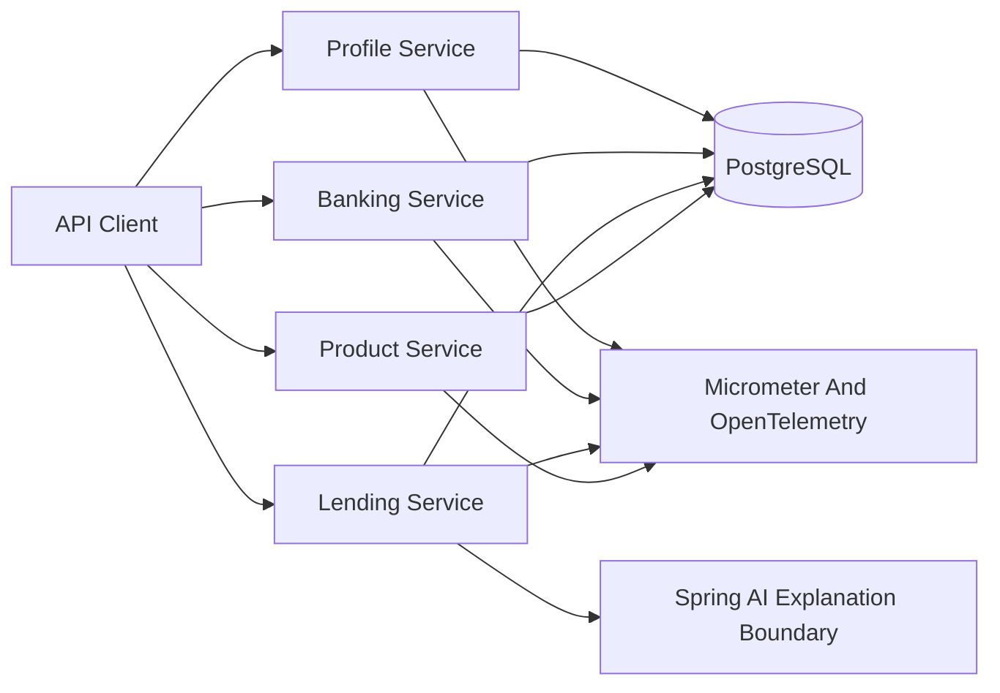

# Fintech Microservices Platform

A modern Java 21 Spring Boot fintech platform showcasing profile, banking, lending, and product/pricing workflows with clean architecture, Testcontainers, OpenTelemetry-ready observability, CI security scanning, and an AI-assisted lending explanation boundary.

## Why This Exists

This repository was rebuilt from a mixed legacy collection into one intentional showcase. Old Java 1.6/Spring 3 demos, generated docs, Go/Python samples, frontend experiments, `target/` output, and vulnerable dependency stacks were removed. The current tree is only the platform.

## Architecture



## Modules

| Module | Purpose | Port | Docs |
| --- | --- | ---: | --- |
| `services/profile-service` | Customer profile CRUD, validation, and email uniqueness | 8081 | `/docs` |
| `services/banking-service` | Account opening, deposits, withdrawals, and overdraft-safe rules | 8082 | `/docs` |
| `services/lending-service` | Loan intake, deterministic underwriting, and AI-ready explanations | 8083 | `/docs` |
| `services/product-service` | Product and pricing catalog inspired by the old retail sample | 8084 | `/docs` |
| `platform/common-domain` | Small shared primitives like `Money` and domain exceptions | n/a | n/a |
| `platform/observability` | Shared Micrometer application tags and observability auto-configuration | n/a | n/a |
| `platform/test-support` | PostgreSQL Testcontainers support | n/a | n/a |

## Clean Architecture

Each service follows the same boundary:

```text
api/             REST controllers, request records, response records, Problem Details
application/     use cases and orchestration
domain/          business language and policy results
infrastructure/  JPA entities and repositories
config/          service-specific configuration when needed
```

Controllers do not hold business rules. Persistence classes do not leak into API contracts. Shared modules stay intentionally small.

## Quickstart

Prerequisites: Java 21, Docker, and Maven or the generated Maven wrapper.

```bash
docker compose -f docker/compose.yml up -d postgres prometheus grafana
./mvnw clean verify
./mvnw -pl services/lending-service spring-boot:run
```

Sample lending request:

```bash
curl -X POST http://localhost:8083/api/v1/loan-applications \
  -H 'Content-Type: application/json' \
  -d '{
    "customerId": "customer-1001",
    "requestedAmount": 25000,
    "annualIncome": 140000,
    "monthlyDebt": 1200,
    "creditScore": 742
  }'
```

## Engineering Highlights

- Java 21 with records and virtual-thread-ready Spring Boot services.
- Spring Boot 3.4.x, Jakarta APIs, validation, actuator, and OpenAPI.
- PostgreSQL-first persistence with Flyway migrations.
- Testcontainers-backed integration test support.
- Deterministic lending policy with an AI explanation boundary, keeping decisions auditable.
- Micrometer and OpenTelemetry-ready observability.
- Docker Compose for local infrastructure and CI workflow for build/test/security checks.
- ADRs and legacy inventory documenting modernization decisions.

## Local URLs

- Profile docs: http://localhost:8081/docs
- Banking docs: http://localhost:8082/docs
- Banking showcase landing page: http://localhost:8082/
- Lending docs: http://localhost:8083/docs
- Product docs: http://localhost:8084/docs
- Prometheus: http://localhost:9090
- Grafana: http://localhost:3000

## Public Showcase Deployment

The banking service is configured to run publicly at `https://bankservice.apicode.io` with Caddy-managed TLS.

```bash
cp .env.example .env
chmod +x scripts/deploy-bankservice.sh
./scripts/deploy-bankservice.sh
```

Public showcase URLs:

- Landing page: https://bankservice.apicode.io/
- Swagger UI: https://bankservice.apicode.io/docs
- OpenAPI JSON: https://bankservice.apicode.io/v3/api-docs
- Showcase metadata: https://bankservice.apicode.io/api/v1/showcase

Deployment details are documented in `docs/deployment/bankservice-apicode.md`.

## AWS Deployment

The recommended AWS deployment uses ECS Fargate, ECR, RDS PostgreSQL, an Application Load Balancer, ACM, and Route53.

```bash
cp .env.aws.example .env.aws
chmod +x scripts/aws-*.sh
./scripts/aws-deploy-all.sh
```

AWS deployment details are documented in `docs/deployment/aws-bankservice.md`.

## Legacy Cleanup

See `docs/legacy-inventory.md` for the disposition of the original imported projects and the security cleanup notes.
