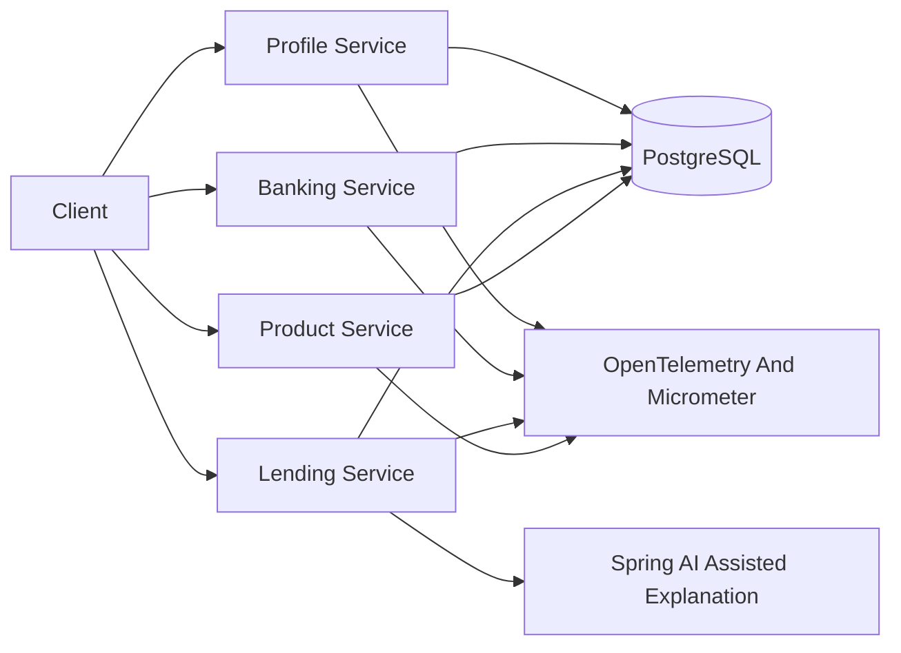

# Architecture Overview

The platform is a Java 21 Spring Boot fintech showcase organized as deployable services plus tiny platform libraries. Each service follows the same package boundary: `api`, `application`, `domain`, `infrastructure`, and `config`.

## Module Responsibilities

- `profile-service`: customer profile lifecycle, address data, email uniqueness, and profile audit timestamps.
- `banking-service`: account opening, balances, deposits, withdrawals, and overdraft-safe transaction rules.
- `lending-service`: loan application intake, deterministic underwriting rules, audit-friendly decisions, and AI-assisted explanation boundaries.
- `product-service`: product and pricing catalog inspired by the old retail sample, implemented with the same modern PostgreSQL foundation.
- `platform/common-domain`: small shared primitives and exceptions only.
- `platform/observability`: auto-configuration for common metrics/tags.
- `platform/test-support`: reusable Testcontainers PostgreSQL setup.
